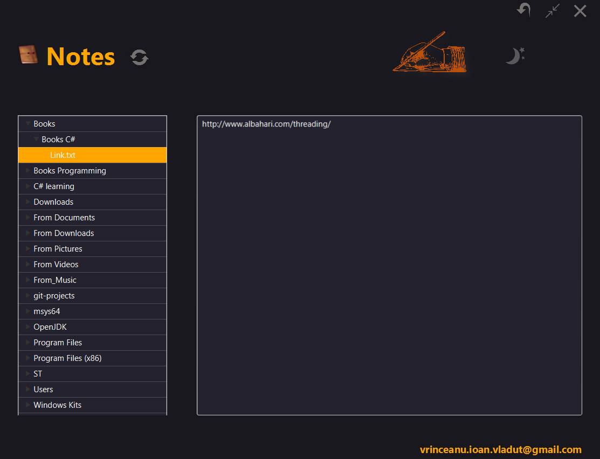
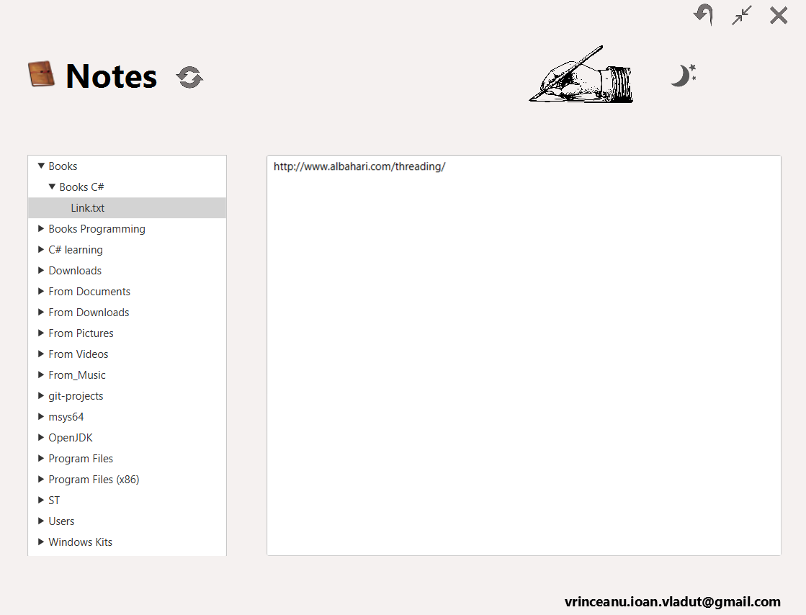
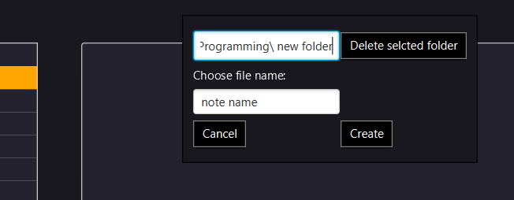
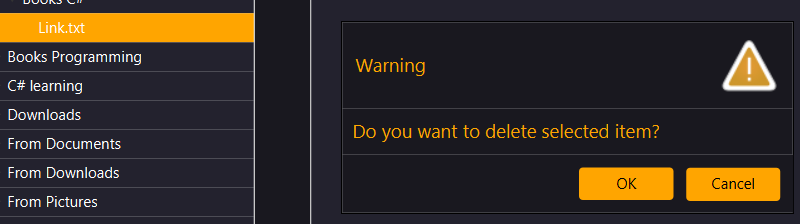
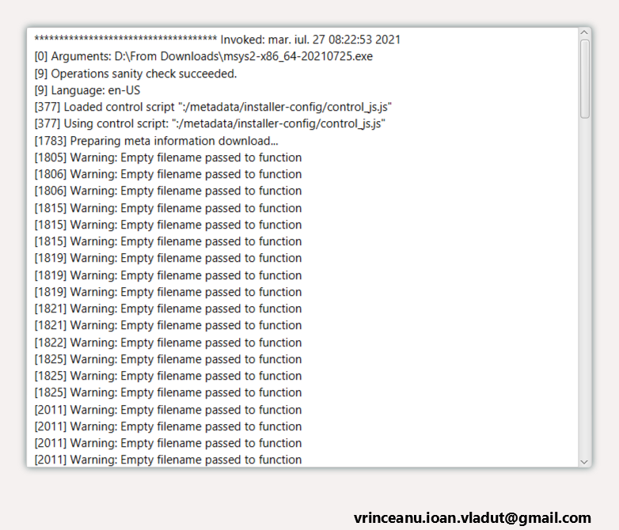

`Notes`

Java notes application which can be used to write notes as .txt files.

`1. Features:`
- black/white theme (frameless):

  

- add folder / text file / delete folder/ delete file (right click on three view)

  

- read / write notes

  

- resize

- save configuration to config.ini (night or white mode)  

`2. How to:`
- after compile start .jar file with notes root folder parameter as following:
java -jar notes.jar "D:\notes"
  

